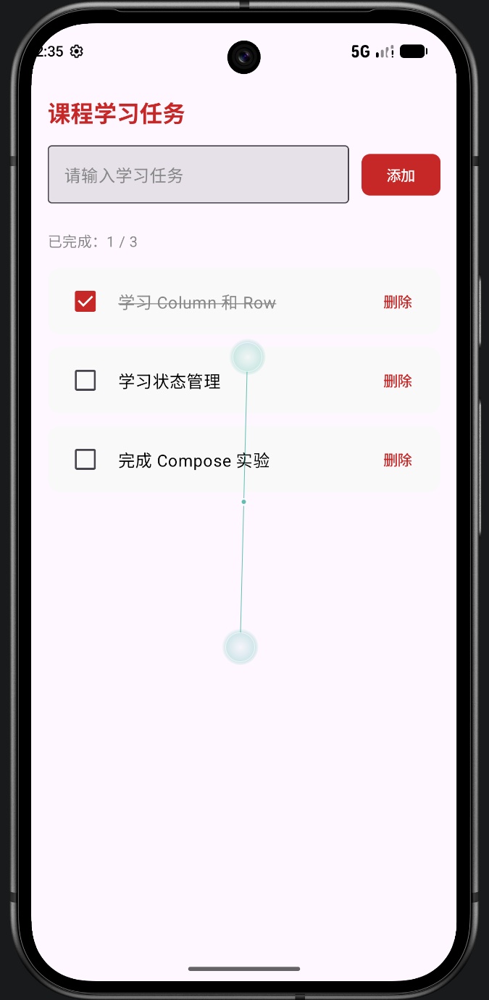
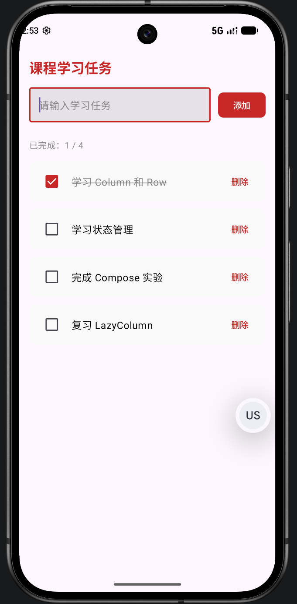
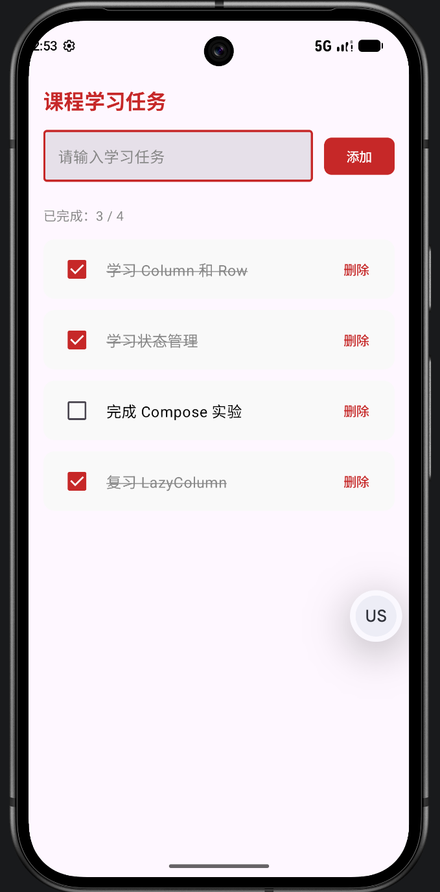

# 📱 Android 界面布局与 Compose 综合实验

## 📖 项目简介
本项目是一个 Android 基础 UI 布局的深度实践项目。旨在通过复刻多个具有代表性的用户界面，深入剖析和对比 Android 传统视图体系中三种核心布局（`LinearLayout`、`TableLayout`、`ConstraintLayout`）的应用场景与优缺点。同时，项目引入了现代化的声明式 UI 框架 **Jetpack Compose** 进行状态管理实践，并全面接入了 Android 现代化的沉浸式全屏（Edge-to-Edge）显示方案。

---

## 🛠️ 开发环境与依赖

- **Min SDK Version**: API 24 (Android 7.0 Nougat)
- **Target / Compile SDK Version**: API 37
- **编程语言**: Java 11 / Kotlin 2.0+ 混编
- **Gradle JVM**: JDK 25
- **核心依赖**:
   - `androidx.constraintlayout:constraintlayout`
   - `androidx.core:core-ktx`
   - `androidx.compose:compose-bom` (Jetpack Compose 物料清单)
   - `androidx.activity:activity-compose`

---

## 📱 实验模块详细解析

### 📍 项目主导航 (MainActivity)
作为应用程序的入口，主界面提供了一个直观的导航列表，通过点击不同的按钮通过 `Intent` 路由至五个独立的实验 Activity。

  

---

### 🧪 实验一：线性布局深度实践 (LinearLayout)
**设计目标**：在不使用 `GridLayout` 的前提下，纯靠 `LinearLayout` 实现一个复杂的 4x4 网格自适应排版。

**核心技术详解**：
1. **多层级嵌套**：外层使用垂直方向 (`orientation="vertical"`) 的线性布局作为容器，内层嵌套 4 个水平方向 (`orientation="horizontal"`) 的线性布局代表每一行。
2. **权重自适应 (`layout_weight`)**：为了实现网格在不同屏幕宽度下的完美比例，彻底放弃了硬编码的 `dp` 宽度，将 `layout_width` 设置为 `0dp`，并根据需求分配不同的权重（如 `1 : 1.6 : 1.3 : 1.1`）。
3. **UI 美化**：利用自定义的 Drawable (`border_box.xml`) 为每个 TextView 绘制带边框的背景。

  

---

### 🧪 实验二：表格布局实践 (TableLayout)
**设计目标**：模拟桌面端软件经典的下拉菜单栏视图（包含功能名称与对应的快捷键，并实现两端对齐）。

**核心技术详解**：
1. **行容器 (`TableRow`)**：利用 `TableRow` 自动管理水平方向的子控件，使得每一行的功能名称和快捷键处于同处于一个逻辑行中。
2. **自动拉伸 (`stretchColumns`)**：通过在根节点声明 `android:stretchColumns="1"`（索引从 0 开始，1 代表第二列），强制快捷键列占据所有的剩余空白宽度，从而实现完美的“左对齐+右对齐”两端分布效果。
3. **分隔线绘制**：巧妙利用高度为 `1dp` 且背景色为深灰色的 `<View>` 组件充当菜单组之间的水平分割线。

  

---

### 🧪 实验三：约束布局初级实践 (ConstraintLayout 1)
**设计目标**：实现一个标准的计算器数字面板，解决传统布局中层级过深导致的性能问题。

**核心技术详解**：
1. **扁平化结构**：整个界面的所有 UI 控件均处于同一层级，彻底消除了视图树的嵌套开销。
2. **水平链条 (Horizontal Chain)**：选中每一行的 4 个按钮建立 Chain，并应用 `app:layout_constraintHorizontal_chainStyle="spread"`，使它们在水平方向上自动且均匀地拉开间距。
3. **匹配约束 (`match_constraint`)**：将按钮的 `layout_width` 设为 `0dp`，让其宽度完全交由 ConstraintLayout 的链条规则和约束点来决定。

  

---

### 🧪 实验四：约束布局高级实践 (ConstraintLayout 2)
**设计目标**：实现一个富有设计感的“太空航班预订”界面，挑战组件之间的重叠、精确定位与相对环绕效果。

**核心技术详解**：
1. **引导线基准 (`Guideline`)**：在屏幕正中央设置了一条垂直的百分比引导线 (`app:layout_constraintGuide_percent="0.5"`)。DCA 卡片在其左侧，MARS 卡片在其右侧，确保了严格的对称性。
2. **组件重叠与图层 (`Elevation`)**：将中间的双向箭头按钮 (`btn_sync`) 强行约束在 Guideline 的中心，利用其自身的宽度完美覆盖在两张绿色卡片的间隙上方，形成视觉错层。
3. **圆形轨道定位 (`Circular Positioning`)**：抛弃了传统的 XY 坐标系，使用极坐标系的思路来定位“环绕的火箭”。
   - `app:layout_constraintCircle="@id/iv_planet"`：以星球图片为圆心。
   - `app:layout_constraintCircleAngle="270"`：设定火箭处于圆心正左侧 270 度方向。
   - `app:layout_constraintCircleRadius="95dp"`：设定环绕半径，精准控制二者距离。

  

---

### 🚀 实验五：Jetpack Compose 状态管理 (课程学习任务)
**设计目标**：脱离传统的 XML 视图体系，使用纯 Kotlin 代码和 Jetpack Compose 框架实现一个支持动态数据交互的“课程学习任务”管理列表。

**核心技术详解**：
1. **声明式 UI 构建**：利用 `Column`、`Row`、`Card` 等 Composable 函数快速搭建出极具现代化风格的界面，抛弃了繁杂的 XML 节点。
2. **状态驱动 (State Management)**：通过 `remember { mutableStateOf() }` 和 `mutableStateListOf` 包装数据，实现了数据与 UI 的“单向数据流”。只要数据源发生改变，UI 就会自动触发重组（Recomposition）。
3. **动态列表渲染 (`LazyColumn`)**：使用 `LazyColumn` 替代了传统的 `RecyclerView` + `Adapter` 方案，以极简的代码实现了支持复用的长列表渲染。

**交互逻辑演示**：
- **添加任务**：输入框支持双向绑定，点击按钮后动态向列表中插入新任务，顶部总数实时刷新。
- **状态同步**：勾选 Checkbox 后，任务文本自动改变颜色并增加**删除线** (`TextDecoration.LineThrough`)，顶部的“已完成”计数器精准递增。
- **动态删除**：点击单项的删除按钮，从状态列表中移除对应对象，UI 瞬间自适应更新。

  
  &nbsp;&nbsp;
  
  &nbsp;&nbsp;
  

---

## 🌟 核心技术亮点：沉浸式状态栏 (Edge-to-Edge)

为了顺应现代 Android 设计规范，本项目没有使用老旧的 ActionBar，而是实现了全局的无边框沉浸式体验：

1. **全面屏使能**：在所有 Activity 的 `onCreate` 中调用 `EdgeToEdge.enable(this)`。
2. **动态 Insets 处理**：利用 `ViewCompat.setOnApplyWindowInsetsListener` 监听系统窗口（状态栏、导航栏、刘海屏）的尺寸，并将这些尺寸以 `Padding` 的形式叠加到根视图上，既实现了背景的沉浸延展，又保证了内容不会被系统 UI 遮挡。
3. **状态栏图标智能变色**：由于各实验的背景色差异巨大（如 LinearLayout 为纯黑，MainActivity 为浅灰），项目中通过 `WindowInsetsControllerCompat.setAppearanceLightStatusBars()` 根据背景颜色的深浅，动态将状态栏文字和图标切换为黑色或白色，保证了极致的可读性。

---

## 🚀 运行与编译指南

1. **克隆项目**到本地开发环境。
2. 使用 **Android Studio** 打开项目根目录。
3. 确保你的环境中已配置好 **Java 11 / JDK 25** 以及 **Android SDK (API 37)**，并已开启全局科学网络代理以顺畅拉取 Compose 依赖库。
4. 待 Gradle 底部进度条同步完成后（无报错状态），点击顶部的 `Run 'app'` 即可在模拟器或实体测试机上体验。